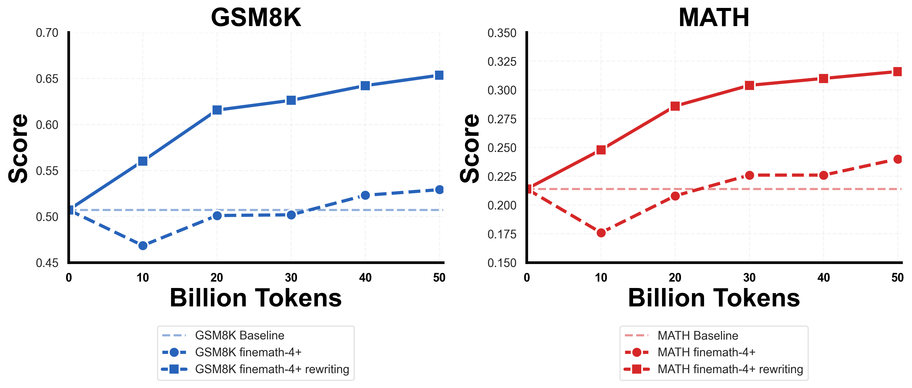
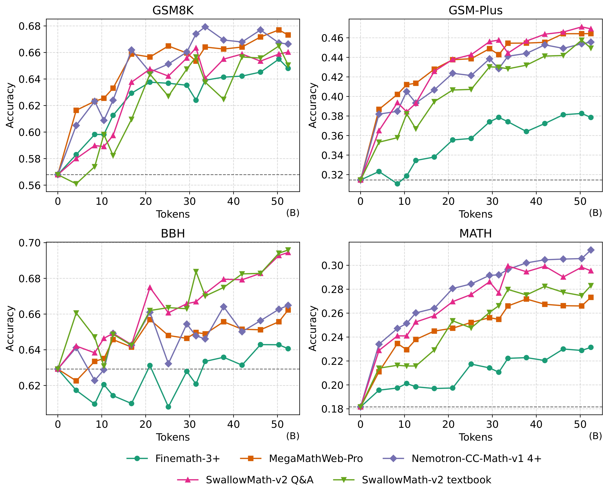

## Links

- 📝 [SwallowCode-v1 🤗](https://huggingface.co/datasets/tokyotech-llm/swallow-code) (Llama-3.3 license)
- 📊 [SwallowMath-v1 🤗](https://huggingface.co/datasets/tokyotech-llm/swallow-math) (Llama-3.3 license)

- 📝 [SwallowCode-v2 🤗](https://huggingface.co/datasets/tokyotech-llm/swallow-code-v2) (Apache-2.0 license)
- 📊 [SwallowMath-v2 🤗](https://huggingface.co/datasets/tokyotech-llm/swallow-math-v2) (Apache-2.0 license)

- 📄 Paper: [Rewriting Pre-Training Data Boosts LLM Performance in Math and Code](https://arxiv.org/abs/2505.02881) (arXiv)

---

## About

**SwallowCode** and **SwallowMath** are a family of open datasets built to advance the code generation and mathematical reasoning capabilities of open large language models (LLMs).
As of **November 2025**, two major versions — v1 and v2 — have been released, each significantly improving both dataset quality and accessibility for the research community.

Launched as a **sub-project of the [Swallow Project](https://swallow-llm.github.io/index.en.html)**, which develops bilingual (Japanese–English) open LLMs, SwallowCode and SwallowMath aim to provide **high-quality, permissively licensed datasets** to the open research ecosystem.
The project emphasizes scalability, reproducibility, and transparency, ensuring that the community can use these datasets freely for mid pre-training.

The project began in **October 2024**, when reasoning ability became a major research focus following the release of OpenAI’s **o1** model.
Initially, our approach centered on **filtering-based curation**, but we soon realized that filtering alone was insufficient to enhance reasoning performance.
Through extensive experimentation, we discovered that **LLM-based rewriting**—where models regenerate existing samples with improved syntactic, semantic, and logical consistency—was far more effective at enhancing the quality of both code and math corpora.

This insight led to the creation of **SwallowCode-v1** and **SwallowMath-v1**, followed by the large-scale **v2 releases**, which demonstrated that systematic rewriting pipelines can dramatically improve dataset quality while maintaining full openness under the **Apache-2.0 license**.

---

## Version 1

The first-generation datasets, **SwallowCode-v1** and **SwallowMath-v1**, were released in **May 2025**.
Their effectiveness was verified through **50B-token continual pre-training** from Llama-3.1-8B, which resulted in substantial performance gains.

Compared with other open datasets:

- **Code:** +17.0 points on HumanEval and +16.1 on HumanEval+ versus [Stack-Edu](https://huggingface.co/datasets/HuggingFaceTB/stack-edu)
- **Math:** +12.4 points on GSM8K and +7.6 on MATH versus [FineMath-4+](https://huggingface.co/datasets/HuggingFaceTB/finemath)

No data contamination was detected via _exact match_ or Jaccard similarity analysis.
The methodology and insights from these datasets are described in detail in our paper
👉 [Rewriting Pre-Training Data Boosts LLM Performance in Math and Code](https://arxiv.org/abs/2505.02881).

##### Comparison of SwallowCode-v1 with other open code datasets


##### Dataset pipeline used in SwallowCode-v1


##### Comparison of SwallowMath-v1 with other open math datasets



---

## Version 2

After the v1 release, we aimed to make the datasets more **accessible and legally permissive**, transitioning from the **Llama 3.3 Community License** to **Apache-2.0**.
We also sought to expand the dataset size — since SwallowCode-v1 (16.1B tokens) and SwallowMath-v1 (~3B tokens) were relatively small for mid-stage pretraining.
Our target for v2 was to **triple the dataset size** while maintaining or improving quality through refined corpus selection and rewriting.

### SwallowCode-v2

SwallowCode-v2 introduces a fully redesigned pipeline incorporating **`ruff`-based auto-formatting** and multi-stage **LLM-based quality scoring**.
Using The Stack v2 as the base, we applied the **[SeedCoder](https://arxiv.org/abs/2506.03524)'s code scoring prompt** to classify samples into _High_, _Medium_, and _Low_ quality tiers.
Only _High_ and _Medium_ tiers were used for rewriting, and we found that **Medium-quality samples rewritten by Qwen3-235B-A22B** actually produced better downstream model performance than ones from the _High_ tier.
Thus, SwallowCode-v2 was built primarily from rewritten from Medium-quality samples.

##### Comparison of SwallowCode-v2 with other open code datasets


##### Dataset pipeline used in SwallowCode-v2


In the Swallow Project, we continued pretraining _Qwen3-8B-Base_ on **SwallowCode-v2** and its derived **SwallowCode-v2 QA** dataset.
No degradation in HumanEval/HumanEval+ performance was observed, suggesting that SwallowCode-v2 maintains high enough quality for **mid-stage pretraining of models at the Qwen3 performance level**.
We plan to release the full implementation of the dataset pipeline and the QA-augmented variant in future updates.

### SwallowMath-v2

SwallowMath-v1 was based on FineMath-4+ (9.6B tokens), which limited its scale.
For SwallowMath-v2, we instead used FineMath-3+ as the base corpus to increase data volume, while exploring multiple **rewriting formats** to enhance diversity.
Through this, we constructed **SwallowMath-v2 QA** and **SwallowMath-v2 Textbook**, datasets comparable in quality to **Nemotron-CC-Math-v1 4+**, and achieving state-of-the-art performance among open datasets on **GSM-Plus** and **BBH** benchmarks.

##### Comparison of SwallowMath-v2 with other open math datasets



---

### Project Team

Core contributors responsible for dataset construction and experiments:

- [**Kazuki Fujii**](https://www.linkedin.com/in/kazuki-fujii/) — Designed the experiments, implemented the data pipeline, and conducted large-scale pretraining experiments.
- [**Yukito Tajima**](https://www.linkedin.com/in/yukito-tajima-51bbb2299/) — Implemented and optimized the data and inference pipelines (vLLM, TensorRT-LLM).
- [**Masaki Kawamura**](https://www.linkedin.com/in/masaki-kawamura-0806a7361/) — Co-designed experiments, evaluated models, and conducted visualization and analysis.

While we hope to continue developing **SwallowCode-v3** and **SwallowMath-v3**, each contributor is primarily focused on separate research topics, so the project’s future is currently uncertain.

---

### Citation

```BibTeX
@misc{fujii2025rewritingpretrainingdataboosts,
      title={Rewriting Pre-Training Data Boosts LLM Performance in Math and Code},
      author={Kazuki Fujii and Yukito Tajima and Sakae Mizuki and Hinari Shimada and Taihei Shiotani and Koshiro Saito and Masanari Ohi and Masaki Kawamura and Taishi Nakamura and Takumi Okamoto and Shigeki Ishida and Kakeru Hattori and Youmi Ma and Hiroya Takamura and Rio Yokota and Naoaki Okazaki},
      year={2025},
      eprint={2505.02881},
      archivePrefix={arXiv},
      primaryClass={cs.LG},
      url={https://arxiv.org/abs/2505.02881},
}
```
